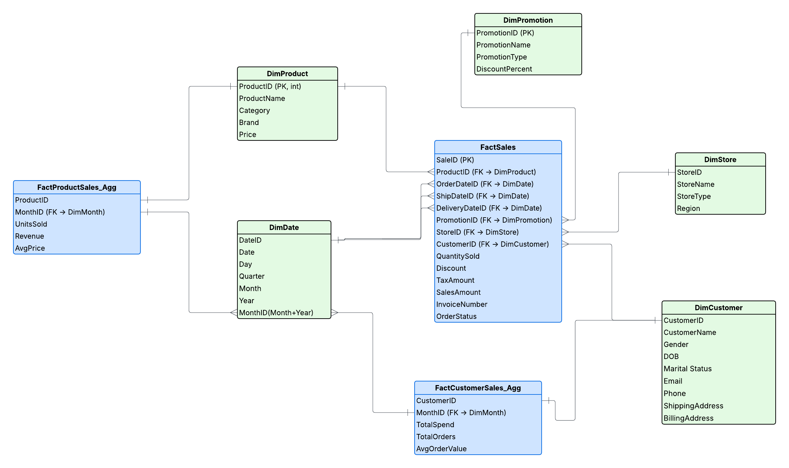
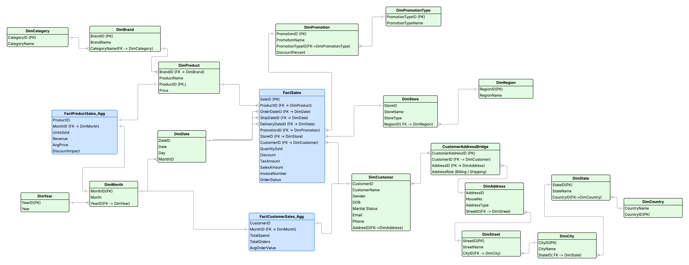

# 📚 Week 1 – Data Modeling Fundamentals & GitHub Basics

This week focused on building a strong foundation in data modeling and source control using GitHub, alongside designing a star schema for a sales analytics data warehouse.

---

## 🧠 Topics Covered

### 🔄 Data Modeling Concepts

- OLTP vs OLAP systems
- Star vs Snowflake schema design
- Data partitioning and clustering concepts

### 🛠️ Hands-on Activities

- Designed a **Star Schema** for a sales analytics use case

- Created Entity Relationship Diagram (ERD)
- Defined SQL DDL statements for all fact and dimension tables

---

## 📁 Week 1 Deliverables

- Star schema and Snowflake Schema ERD diagram
- SQL schema script
- GitHub repo initialized with:
  - Schema files
  - ERD diagram
  - README documentation

---

## Schema Diagrams

